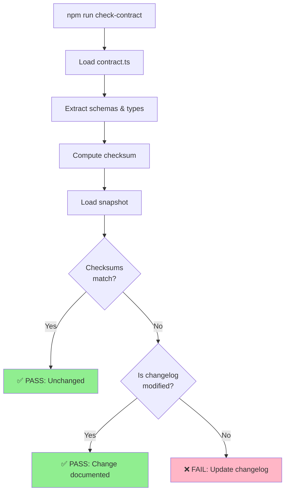
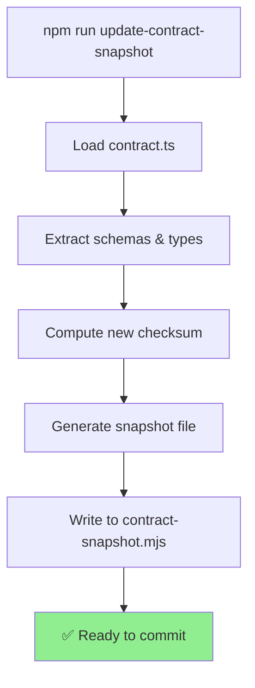

# Contract Changelog Gate Guide

## Overview

The **Contract Changelog Gate** is a constitutional enforcement mechanism that prevents any modification to `types/contract.ts` (The Law) unless the change is explicitly documented in `docs/contract-gate/CHANGELOG.md`.

This ensures:
- **No silent schema drift** — every change is intentional and logged
- **System-wide awareness** — all developers know about contract modifications
- **Backwards compatibility** — migrations and impacts are documented
- **Audit trail** — complete history of schema evolution

## How It Works

### The Two-Step Workflow

When you need to modify `types/contract.ts`:

1. **Make your change** to `types/contract.ts`
2. **Document it** in `docs/contract-gate/CHANGELOG.md`
3. **Run the gate** to verify: `npm run check-contract`
4. **Update the snapshot** intentionally: `npm run update-contract-snapshot`
5. **Commit everything together**

### Gate Logic

```
┌─────────────────────┐
│ Run check-contract  │
└──────────┬──────────┘
           │
    ┌──────┴──────┐
    │             │
    ▼             ▼
Contract    Snapshot
Checksum    Checksum
    │             │
    └──────┬──────┘
           │
      Same? ──YES──> ✅ PASS: Contract unchanged
           │
           NO
           │
           ▼
docs/contract-gate/CHANGELOG.md
    Modified?
           │
      ┌────┴────┐
      │         │
     YES       NO
      │         │
      ▼         ▼
     ✅       ❌
    PASS     FAIL
```

## Commands

### ✅ Check Contract (CI & Local)

```bash
npm run check-contract
```

**Purpose:** Detects changes to `types/contract.ts` and ensures they're documented.

**Exit codes:**
- `0` = Contract unchanged, or changed with changelog updated
- `1` = Contract changed but changelog not updated (FAILURE)
- `2` = Error reading files

**Output example (unchanged):**
```
🔐 Contract Changelog Gate

Current checksum:  78ae8fc6
Snapshot checksum: 78ae8fc6

✅ Contract unchanged. Gate passes.
```

**Output example (unauthorized change):**
```
🔐 Contract Changelog Gate

Current checksum:  575fd648
Snapshot checksum: 78ae8fc6

⚠️  Contract has changed.

❌ GATE FAILURE: Contract changed but docs/contract-gate/CHANGELOG.md was not updated!
Rules:
  1. Any change to types/contract.ts requires a changelog entry.
  2. Document the change, its impact, and rationale.
  3. Update docs/contract-gate/CHANGELOG.md and commit together with your changes.
```

### 📸 Update Contract Snapshot

```bash
npm run update-contract-snapshot
```

**Purpose:** Regenerates the snapshot after documenting your changes.

**When to use:**
- Once you've documented your change in `docs/contract-gate/CHANGELOG.md`
- Before committing
- Only intentionally (not automatic)

**Output example:**
```
📸 Updating Contract Snapshot

✅ Snapshot updated at /home/eggman/projects/salt/scripts/contract-snapshot.mjs
   Checksum: 78ae8fc6
   Timestamp: 2026-02-16T23:08:33.052Z
   Schemas: 15
   Types: 16

✅ Ready to commit!
```

## Step-by-Step Example

### Scenario: Adding a New Field to Recipe

```bash
# 1. Make your change
vim types/contract.ts
# Add: certificationLevel?: z.enum(['Michelin', 'AA', 'Rosette'])

# 2. Verify the change was made
npm exec -- grep --quiet "certificationLevel" types/contract.ts && echo "✅ Change verified"

# 3. Document it
vim docs/contract-gate/CHANGELOG.md
# Add under "## Entries":
# ### 2026-02-16 - Add Recipe Certification
# **Impact:** Recipe module, archive compatibility
# **Changes:**
# - Added optional `certificationLevel` field to Recipe schema
# **Rationale:** Support Michelin/AA certification tracking for UK fine dining
# **Migration:** None required (field is optional)

# 4. Check the gate
npm run check-contract
# Output: Contract change detected AND documented in changelog ✅

# 5. Update the snapshot
npm run update-contract-snapshot
# Output: Checksum: <new hash>, Ready to commit! ✅

# 6. Commit everything together
git add types/contract.ts docs/contract-gate/CHANGELOG.md scripts/contract-snapshot.mjs
git commit -m "feat: add recipe certification tracking"
```

## The Changelog Template

### Format

```markdown
### [Date] - [Brief Title]
**Impact:** [System-wide effects]
**Changes:**
- [Specific field/type changes]
- [Additions or removals]
**Rationale:** [Why this change was necessary]
**Migration:** [Any data migration steps or backwards compatibility notes]
```

### Example Entry

```markdown
### 2026-02-20 - Extend Unit Schema with Conversions
**Impact:** Shopping module, recipe scaling, inventory calculations
**Changes:**
- Added `conversionFactor` field (number) to Unit schema
- Added `baseUnit` field (string, optional) for compound units
**Rationale:** Support precise ingredient scaling across different unit systems (e.g., cups→ml)
**Migration:** Existing units have null conversionFactor; new units must provide this value
```

## Integration Points

### Local Development

The gate runs manually:
```bash
npm run check-contract
```

Make this part of your pre-commit workflow:
```bash
# .githooks/pre-commit (or your preferred hook)
npm run check-contract || exit 1
```

### CI/CD Pipeline

Add to your GitHub Actions workflow:

```yaml
- name: Verify Contract Changelog
  run: npm run check-contract
```

This ensures every PR maintains the constitutional discipline.

## FAQ

### Q: What happens if I accidentally modify contract.ts without updating the changelog?

**A:** The gate fails and prevents the commit. You must:
1. Edit `docs/contract-gate/CHANGELOG.md` and add your change entry
2. Run `npm run update-contract-snapshot`
3. Commit both files together

### Q: Can I modify the snapshot manually?

**A:** No. The snapshot is auto-generated by `update-contract-snapshot`. Modifying it directly defeats the gate's purpose.

### Q: What if I need to revert a change?

**A:** Add another entry to the changelog documenting the reversion:
```markdown
### 2026-02-21 - Revert: Recipe Certification (Not Ready)
**Impact:** Cancels 2026-02-16 entry
**Changes:**
- Removed `certificationLevel` field
**Rationale:** Feature delayed pending design review
**Migration:** No data cleanup needed (field was never populated in production)
```

Then run `npm run update-contract-snapshot`.

### Q: What if the snapshot is out of sync?

**A:** This should never happen in normal use. If it does:
```bash
# Restore to git state
git checkout scripts/contract-snapshot.mjs
npm run check-contract
# This will tell you exactly what changed
```

### Q: Can I bypass the gate?

**No.** The gate is constitutional. If you need to modify the contract without documentation, that's a process failure, not a technical one. Escalate to the team lead.

## Files

- `types/contract.ts` — The Law (immutable data schema)
- `docs/contract-gate/CHANGELOG.md` — Change documentation (required for gate to pass)
- `scripts/contract-snapshot.mjs` — Snapshot for change detection (auto-generated)
- `scripts/check-contract.mjs` — Gate validation script
- `scripts/update-contract-snapshot.mjs` — Snapshot update script

## Architecture

### Check Gate Flow



### Update Snapshot Flow



## Rules (Non-Negotiable)

1. **Every contract change requires a changelog entry**
2. **Every changelog entry requires a snapshot update**
3. **Changelog and snapshot must be committed together with contract changes**
4. **The snapshot is auto-generated, never hand-edited**
5. **The gate cannot be bypassed** (except by explicitly removing it)

## Support

If the gate fails unexpectedly:

1. **Check the error message** — it's specific about what needs to be documented
2. **Verify your edits** — make sure you actually modified the contract
3. **Update the changelog** — add a clear entry following the template
4. **Run the snapshot update** — `npm run update-contract-snapshot`
5. **Commit together** — all three files: contract, changelog, snapshot
